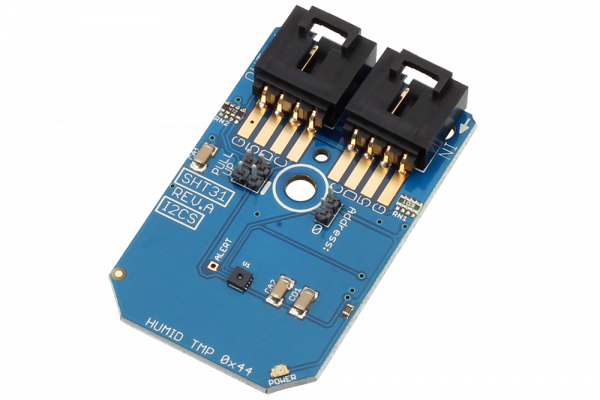

[](https://store.ncd.io/product/sht31-humidity-and-temperature-sensor-%C2%B12rh-%C2%B10-3c-i2c-mini-module/).

#  SHT31

SHT31 is the next generation of Sensirion’s temperature and humidity sensors. The SHT31 has increased intelligence, reliability and improved accuracy specifications compared to its predecessor.
This Device is available from www.ncd.io 

[SKU: SHT31]

(https://store.ncd.io/product/sht31-humidity-and-temperature-sensor-%C2%B12rh-%C2%B10-3c-i2c-mini-module/)
This Sample code can be used with Raspberry Pi.

Hardware needed to interface SHT31 humidity and temperature sensor With Raspberry Pi :
1. <a href="https://store.ncd.io/product/sht31-humidity-and-temperature-sensor-%C2%B12rh-%C2%B10-3c-i2c-mini-module/">SHT31 humidity and temperature sensor</a>
2.  <a href="https://store.ncd.io/product/i2c-shield-for-raspberry-pi-3-pi2-with-outward-facing-i2c-port-terminates-over-hdmi-port/">Raspberry Pi I2C Shield</a>
3. <a href="https://store.ncd.io/product/i%C2%B2c-cable/">I2C Cable</a>

## Python
Download and install smbus library on Raspberry pi. Steps to install smbus are provided at:

https://pypi.python.org/pypi/smbus-cffi/0.5.1

Download (or git pull) the code in pi. Run the program.

```cpp
$> python SHT31.py
```
The lib is a sample library, you will need to calibrate the sensor according to your application requirement.
